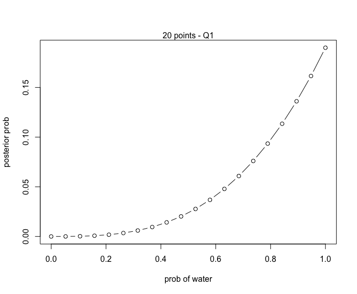
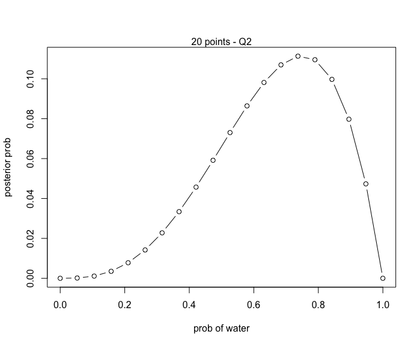
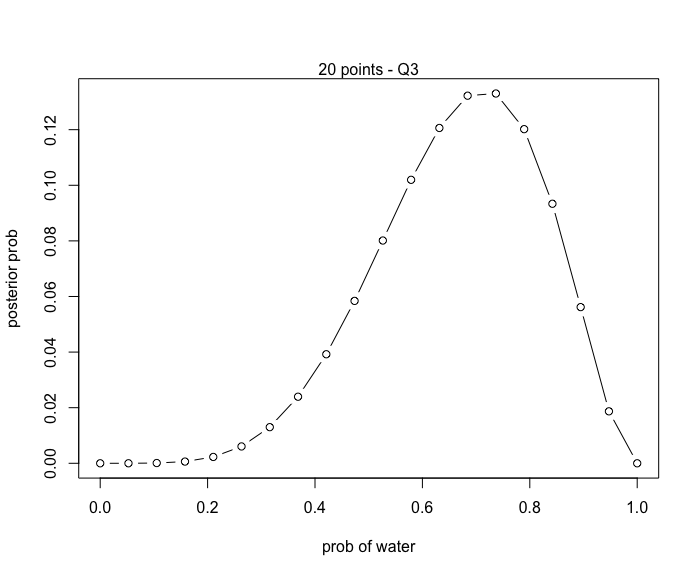
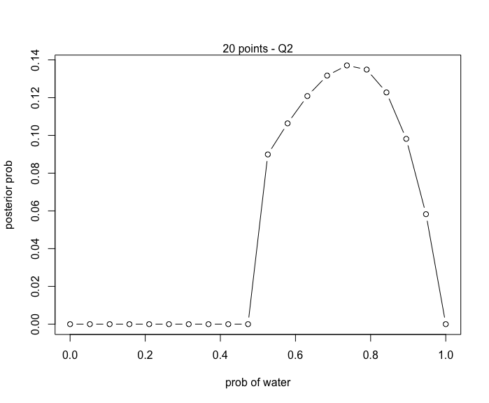
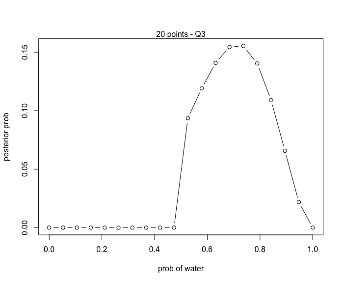
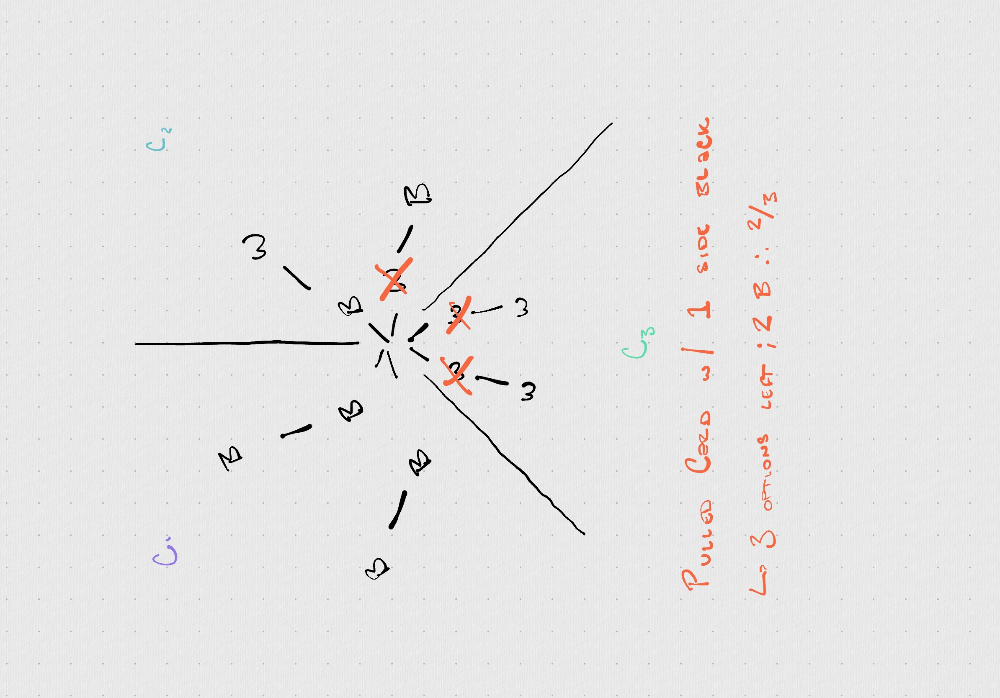
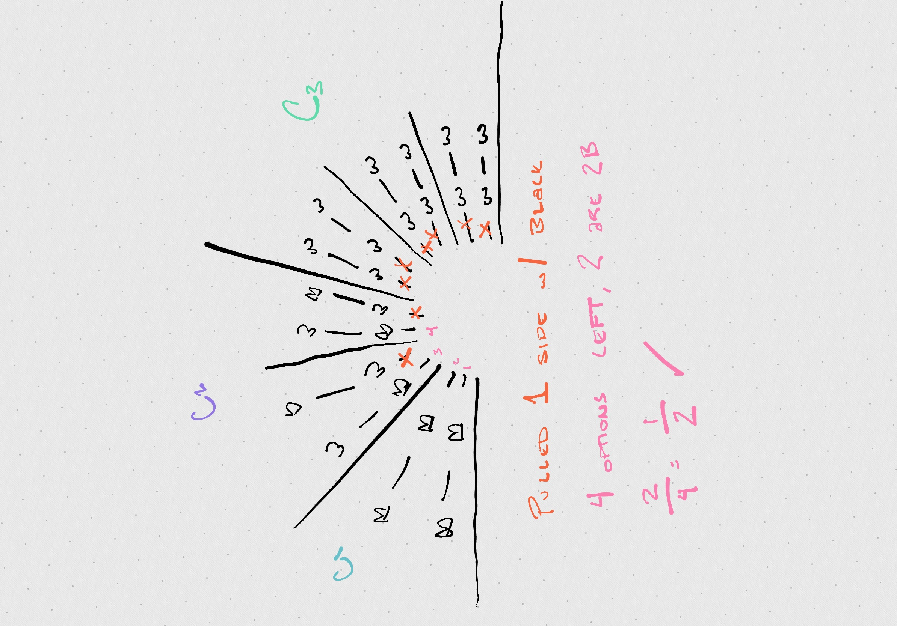

# 2.6 Practice

## Easy

### 2E1. 
* Pr(rain|Monday)
### 2E2.
* The probability that it is Monday, given that it is raining.
### 2E3. 
* Pr(Monday|rain)
* Pr(Monday|rain)Pr(rain)/Pr(rain)
### 2E4.
* It means that our current belief about the true % of the earth that is covered by water is 70%. As we gain more knowledge, we can update our belief about the true proportion of the earth that is covered by water.

## Medium

### 2M1.
Here is the general R code, where at the beginning you define `w` and `l` to be the number of water and land events seen. Then can be run for each situtation:

~~~r
# define w and l
w = 3
l = 0

# define grid (0 to 1 with 20 steps)
p_grid <- seq(0, 1, length.out=20)

# Prior of 1 20 times
prior <- rep(1,20)

# compute likelihood at each value in p_grid
likelihood <- dbinom(w, size=w+l, prob=p_grid)

# compute produce of likelihood and prior
unstd.posterior <- likelihood * prior

# standardize the posterior so it sums to one
posterior <- unstd.posterior / sum(unstd.posterior)

#make the plot
plot(p_grid, posterior, type='b', xlab="prob of water", ylab="posterior prob")
mtext("20 points")
~~~

Question 1:

Question 2:

Question 3:

### 2M2

The code is extremely similar to the code for 2M1. The difference is where the prior is geting calculated.

~~~r
# define w and l
w = 3
l = 0

# define grid (0 to 1 with 20 steps)
p_grid <- seq(0, 1, length.out=20)

# Prior of 0 for p< 0.5, else positive constant
prior <- c(rep(0, 10), rep(1,10))

# compute likelihood at each value in p_grid
likelihood <- dbinom(w, size=w+l, prob=p_grid)

# compute produce of likelihood and prior
unstd.posterior <- likelihood * prior

# standardize the posterior so it sums to one
posterior <- unstd.posterior / sum(unstd.posterior)

#make the plot
plot(p_grid, posterior, type='b', xlab="prob of water", ylab="posterior prob")
mtext("20 points - Q1")
~~~

Question 1:

Question 2:

Question 3:

## 2M3
Given facts:
* Pr(land|Earth) = .3
* Pr(land|Mars = 1)
* Pr(Earth) = .5
* Pr(Mars) = .5

> Start with Bayes

Pr(Earth|land) = Pr(land|Earth)Pr(Earth) / Pr(land)

> Expand the bottom

Pr(land) = Pr(land|Earth)Pr(Earth) + Pr(land|Mars)Pr(Mars)

> Replace the bottom with the new definition

Pr(Earth|land) = Pr(land|Earth)Pr(Earth) / (Pr(land|Earth)Pr(Earth) + Pr(land|Mars)Pr(Mars))

> Place in Values and compute

(.3)(.5) / ((.3)(.5) + (1)(.5)) = .15 / .65 = 0.231

## 2M4

Given:
* Card 1: 2 sides are black
* Card 2: 1 side black, 1 side white
* Card 3: 2 sides white
* Pulled a card, one side is black

Counting Method:

Bayes:

> Pr(2B|B) = Pr(B|2B)Pr(2B) \ Pr(B)
> Pr(2B|B) = (1)(1/3) / (1/2)
> Pr(2B|B) = 2/3

## 2M5
Given:
* Card 1: 2 sides are black
* Card 2: 1 side black, 1 side white
* Card 3: 2 sides white
* Card 4: 2 sides are black

> Pr(2B|B) = Pr(B|2B)Pr(2B) \ Pr(B)
> Pr(2B|B) = (1)(1/2) / (5/8)
> Pr(2B|B) = 4/5

## 2M6

Given:
* Card 1: 2 sides are black
* Card 2: 1 side black, 1 side white
* Card 3: 2 sides white
* For every C_1 card, 2 C_2 and 3 C_3

Counting Method:

## 2M7

Given:
* Card 1: 2 sides are black
* Card 2: 1 side black, 1 side white
* Card 3: 2 sides white

> Pr(B_1, W_2|2B)Pr(BB) / Pr(B_1, W_2)
> = (3/4)(1/3) / (1/3)
> = 3/4

# Hard